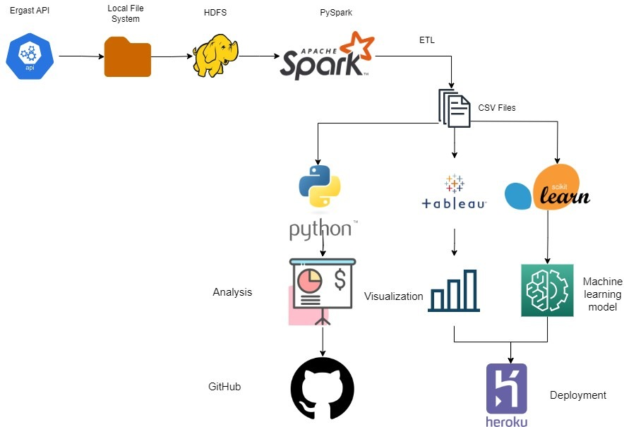
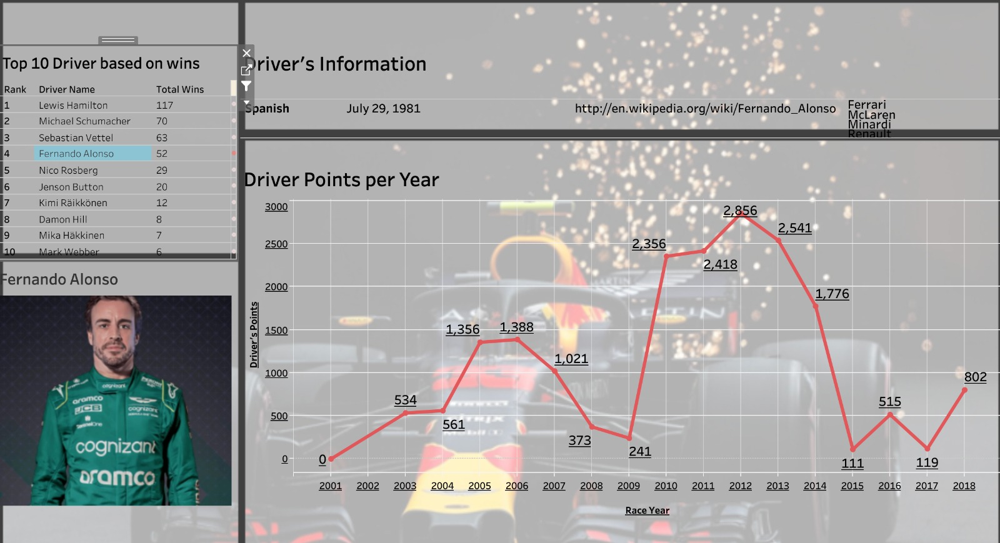

# Fast Lane Forecast

## Introduction

The goal of this project is to perform data analytics on Formula 1 data using various tools and technologies, including Apache Spark, Python, Hadoop and Tableau.

## Architecture 

## Visuals

## Technology Used
- Programming Language - Python

Tech stack
1. Hadoop Distributed File System
2. Apache Spark 
3. Spark SQL
4. Tableau
5. Machine learning

## Website - https://fastlaneforecast-90d27975bbe0.herokuapp.com/

## Dataset Used
Ergast API Formula 1 Data
The Ergast Developer API is an experimental web service which provides a historical record of motor racing data for non-commercial purposes.

Here is the dataset used - 

More info about dataset can be found here:
1. Website - [Ergast API ](http://ergast.com/mrd/)
2. Data Dictionary - [DataBase user guide ](http://ergast.com/docs/f1db_user_guide.txt)http://ergast.com/docs/f1db_user_guide.txt

## Data Model

